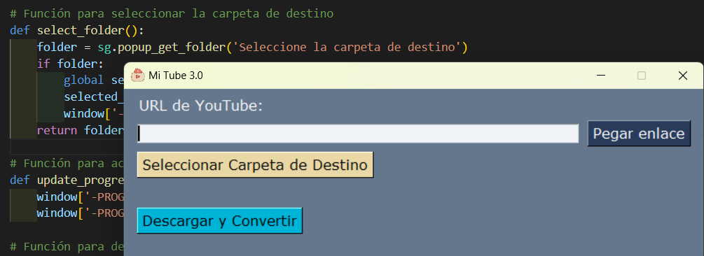

# 🎵 MiTube 3.0 - Descarga música de YouTube fácilmente

**MiTube3.0** es una aplicación de escritorio en Python con interfaz gráfica que permite descargar vídeos de YouTube en **formato MP3** de manera rápida y sencilla.  
Utiliza `yt-dlp` para la descarga y conversión, y `PySimpleGUI` para la interfaz gráfica.



---

## 📦 Requisitos

Antes de usar esta aplicación, asegúrate de tener:

- **Python 3.10 o superior**
- **pip** instalado

Instala las dependencias necesarias con:

```bash
pip install -r requirements.txt
```

🚀 Instalación y Uso
🔽 Clonar el repositorio

```bash
git clone https://github.com/MitoNacho/MiTube.git
cd MiTube

```

📁 (Opcional pero recomendado) Crear un entorno virtual

```bash
python -m venv venv
source venv/bin/activate   # En macOS/Linux
venv\Scripts\activate      # En Windows
```

📥 Instalar dependencias

```bash
pip install -r requirements.txt
```

⚠️ Instalación de ffmpeg:

Para la conversión de audio, `yt-dlp` necesita ffmpeg. Si no lo tienes instalado, descárgalo desde:

🔗 https://ffmpeg.org/download.html

📌 Instrucciones para Windows:

Descarga el ZIP desde el enlace anterior.

Extrae los archivos en C:\ffmpeg.

Agrega C:\ffmpeg\bin al PATH del sistema.

Verifica la instalación con:

```bash
ffmpeg -version
```

🖥️ Funcionalidades


✅ Pegado automático de enlaces desde el portapapeles

✅ Selección de carpeta de destino para las descargas

✅ Conversión automática a .mp3

✅ Barra de progreso interactiva

✅ Interfaz estilizada con colores personalizados


📂 Estructura del proyecto

```bash
MiTube/
│
├── src/
│   ├── gui.py              # Interfaz gráfica (PySimpleGUI)
│   ├── downloader.py       # Lógica de descarga con yt-dlp
│
├── assets/
│   ├── icon.ico            # Icono de la aplicación
│
├── venv/                   # Entorno virtual (ignorar en Git)
│
├── requirements.txt        # Dependencias necesarias
└── README.md               # Este archivo

```


🎵 Ejecutar la aplicación

```bash
python src/gui.py

```


---


🛠️ Contribuir

Si quieres mejorar este proyecto haz un fork del repositorio, crea una nueva rama y envía un pull request con tus mejoras. 😃

💡 Autor  

**Nacho Naves**

GitHub: **@MitoNacho**

Web personal: **https://mitonacho.github.io/dev/**

